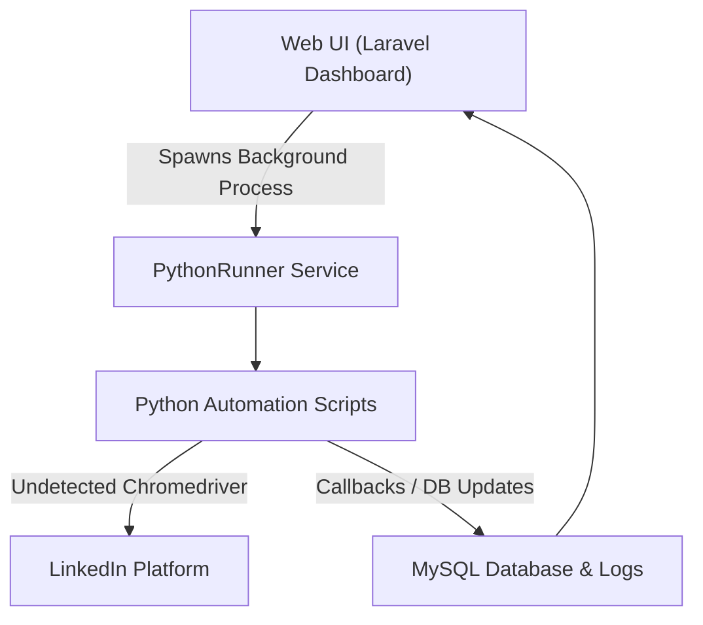
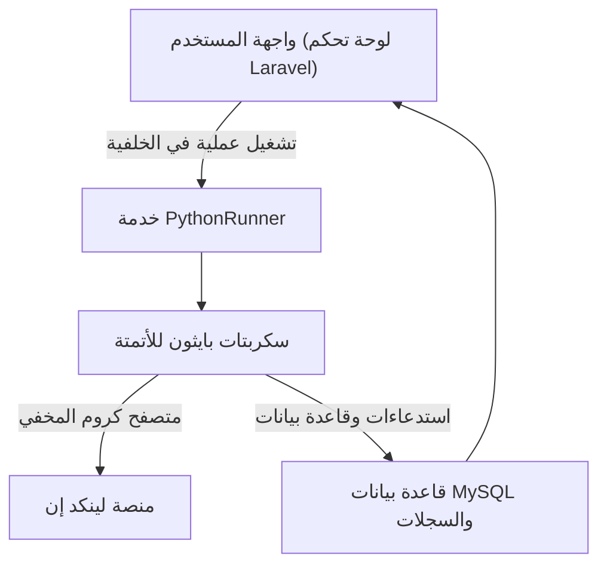

https://github.com/user-attachments/assets/a995bc7f-57bc-42c0-8ffe-54258c5440b3

# 🚀 LinkedIn Pro: Advanced Automation & Outreach Suite

A professional lead generation and automated outreach system that integrates a **Laravel 12** control panel with autonomous **Python Selenium** agents and **Google Gemini AI**.

> [!NOTE]  
> **Repository Scope:**  
> This public repository serves as a portfolio showcase and contains only documentation and architectural designs. The proprietary source code is hosted in a private repository for security and intellectual property protection.

---

## 🏗️ Architectural Overview & Data Flow

### 🌟 Core Features & Workflows
* **🔍 Lead Extraction (Google Dorking)**: Bypasses LinkedIn's commercial search limits by converting search filters into targeted Google Dork queries.
* **⚡ Connection Builder (Macro Replay)**: Automates invitations using DPI-calibrated mouse clicks and automatically adapts to profile button layouts.
* **🤖 AI-Personalized Messaging**: Generates contextual invitation and follow-up messages using Google Gemini AI.
* **📬 Inbox Monitoring**: Periodic background scans automatically mark leads as `Replied` on the dashboard when they respond.

### 🛠️ Technology Stack
* **Control Panel**: Laravel 12, Alpine.js, Tailwind CSS / Custom CSS.
* **Automation Core**: Python 3.13, Selenium, `undetected-chromedriver`.
* **AI Orchestration**: Google Gemini 2.5 Flash / Pro API.
* **Database**: MySQL.

---

# 🚀 نظام أتمتة وإدارة عملاء لينكد إن المتقدم

نظام متميز لإدارة العملاء والتواصل التلقائي على منصة لينكد إن، يدمج بين لوحة تحكم بـ **Laravel 12** ومحركات أتمتة مستقلة بلغة **Python (Selenium)** مع دمج الذكاء الاصطناعي **Google Gemini AI**.

> [!NOTE]  
> **نطاق المستودع:**  
> هذا المستودع العام مخصص للعرض والمحفظة البرمجية فقط ويحتوي على الشرح الفني والهندسي للمشروع. الكود البرمجي الفعلي محفوظ بالكامل في مستودع خاص لحماية الملكية الفكرية والأمان.

---

## 🏗️ نظرة عامة على بنية النظام

### 🌟 مسارات العمل والمميزات الرئيسية
* **🔍 استخراج العملاء المستهدفين (Google Dorking)**: يتخطى قيود البحث التجاري للينكد إن عبر تحويل فلاتر البحث إلى استعلامات بحث متقدمة في جوجل وتوجيهها إقليمياً.
* **⚡ منشئ الاتصالات التلقائي**: يؤتمت إرسال طلبات الإضافة بالاعتماد على إحداثيات دقيقة ويتعرف تلقائياً على واجهة الأزرار وسيناريو الضغط المناسب.
* **🤖 مراسلة معززة بالذكاء الاصطناعي**: صياغة رسائل مخصصة للعملاء بناءً على مسمياتهم الوظيفية الحالية باستخدام Gemini AI.
* **📬 مراقبة صندوق الوارد**: فحص دوري يقوم بتحديث حالة العميل إلى "تم الرد" تلقائياً في لوحة التحكم عند استلام رده.

### 🛠️ التقنيات البرمجية المستخدمة
* **لوحة التحكم والخلفية البرمجية**: Laravel 12، مع واجهات CSS وتأثيرات بصرية متقدمة.
* **محرك الأتمتة**: لغة Python 3، ومكتبة Selenium، ومتصفح `undetected-chromedriver`.
* **الذكاء الاصطناعي**: واجهة برمجة تطبيقات Google Gemini 2.5.
* **قاعدة البيانات**: MySQL.

---

## ⚠️ Disclaimer | إخلاء المسؤولية
This tool is built for educational and research purposes. Automating LinkedIn interactions may violate LinkedIn's Terms of Service. Use responsibly and at your own risk.  
تم تطوير هذه الأداة لأغراض تعليمية وبحثية فقط. قد تؤدي أتمتة العمليات على لينكد إن إلى انتهاك شروط الخدمة الخاصة بالمنصة. استخدمها على مسؤوليتك الخاصة.
