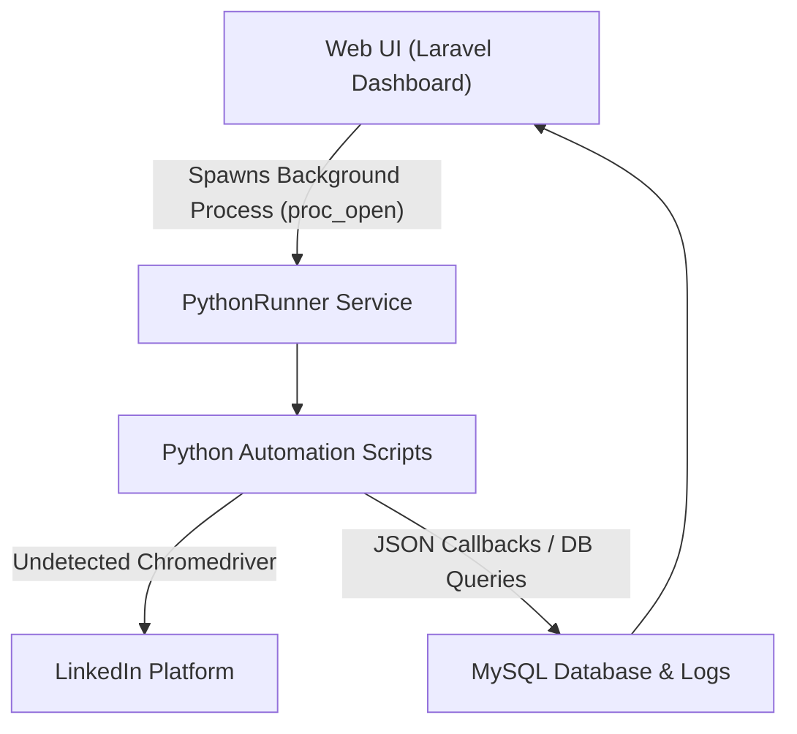
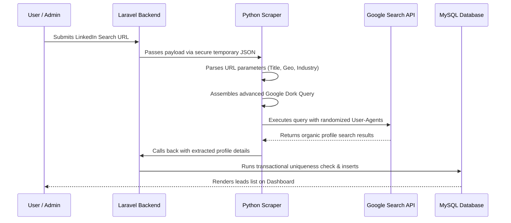
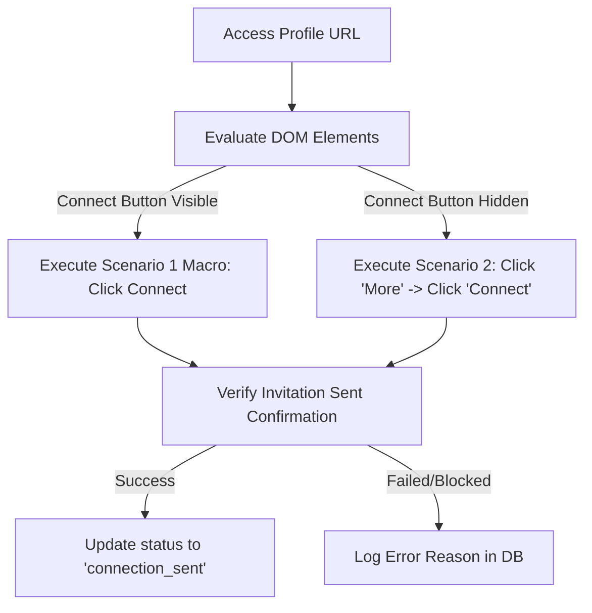
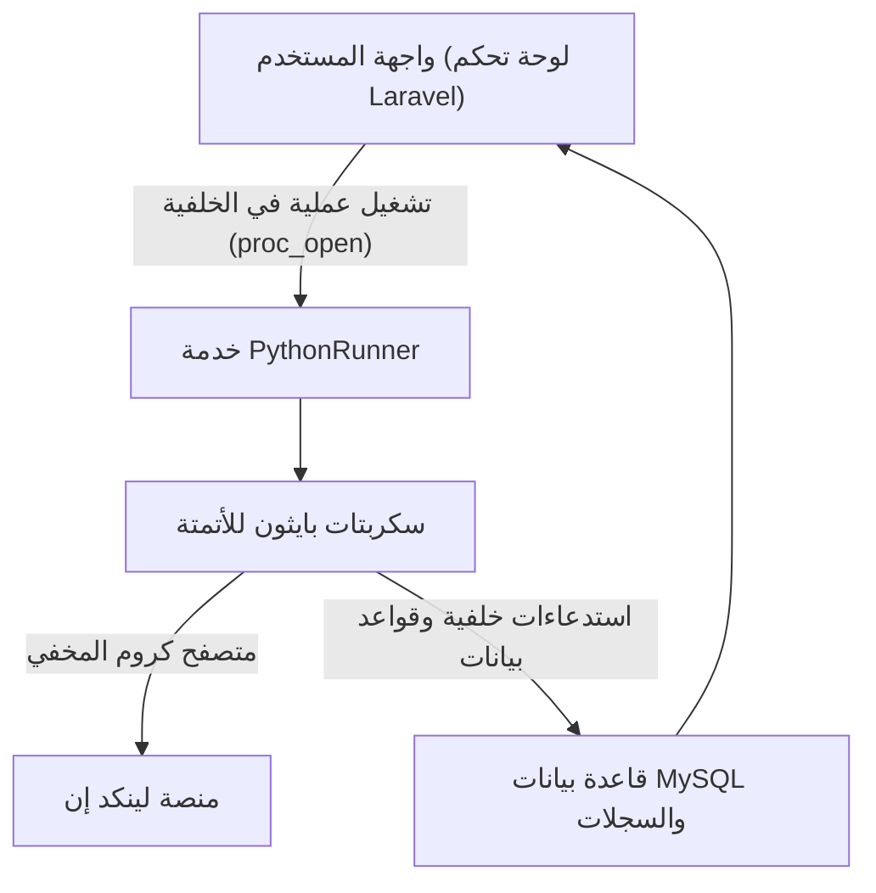
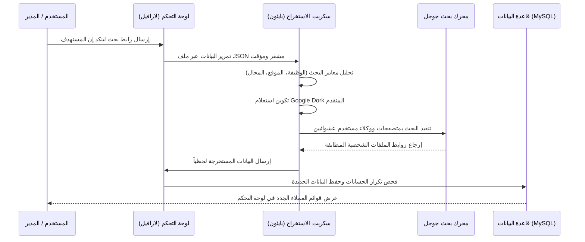
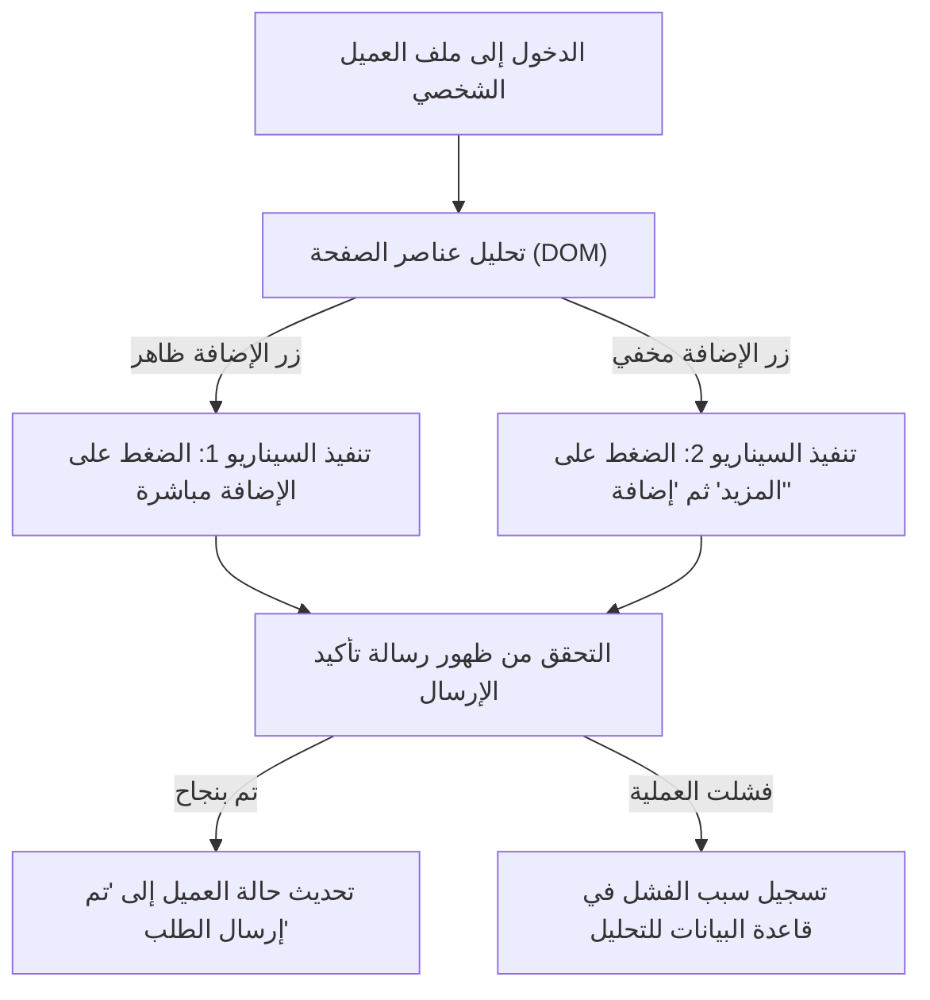

# 🚀 LinkedIn Pro: Advanced Automation & Outreach Suite
### نظام أتمتة وإدارة عملاء لينكد إن المتقدم

A premium, enterprise-grade lead generation and automated outreach system that leverages **Laravel 12** as a control center and **Python Selenium (undetected-chromedriver)** as autonomous browser agents. Powered by **Google Gemini AI**, this suite manages the entire lead lifecycle from extraction to connection building, personalized messaging, and response monitoring.

نظام متميز وعالي الكفاءة لإدارة العملاء والتواصل التلقائي على منصة لينكد إن. يدمج النظام بين قوة إطار عمل **Laravel 12** كمركز تحكم رئيسي، ومحركات أتمتة مستقلة بلغة **Python (Selenium)** لتشغيل المتصفح، مع دمج الذكاء الاصطناعي **Google Gemini AI** لتخصيص الرسائل وإدارة دورة حياة العميل بالكامل من الاستخراج إلى المراسلة وتتبع الردود.

---

> [!NOTE]  
> **Repository Scope | نطاق المستودع:**  
> This public repository serves as a portfolio showcase and contains only documentation and architectural designs. The proprietary source code is hosted in a private repository for security and intellectual property protection.  
> هذا المستودع العام مخصص للعرض والمحفظة البرمجية فقط ويحتوي على الشرح الفني والهندسي للمشروع. الكود البرمجي الفعلي محفوظ بالكامل في مستودع خاص لحماية الملكية الفكرية والأمان.

---

## 📺 Video Showcase | عرض الفيديو التوضيحي
Below is a video walkthrough demonstrating the live execution of the tool, browser control, and lead tracking:  
يوجد أدناه مقطع فيديو توضيحي يستعرض آلية عمل الأداة ولوحة التحكم والتحكم في المتصفح بشكل حي:

📁 **[Watch the LinkedIn Pro Demo Video | شاهد الفيديو التوضيحي](DEMO_VIDEO_LINK_HERE)**

---

# 🇺🇸 English Version

## 🏗️ Architectural Overview & Data Flow
The application utilizes a decoupled architecture where the Laravel backend manages the state, schedules background tasks, and displays real-time statistics, while autonomous Python subprocesses execute browser automations.

---

## 🌟 Key Modules & Core Features

### 1. 🔍 Precision Lead Extractor (Google Dorking Engine)
* **Bypassing Commercial Limits**: Instead of visiting LinkedIn directly (which triggers commercial search limits and accounts flags), the tool converts complex search URLs into optimized Google Dorks.
* **Country Subdomain Routing**: Dynamically maps search queries through global Google subdomains (e.g. `google.ae`, `google.co.uk`) matching the target country to fetch localized results.
* **Data Cleansing & Deduplication**: Extracted data (names, titles, locations, companies, avatar URLs) undergoes a pre-save database check to prevent duplicate outreach.

#### Lead Extraction Flow:

### 2. ⚡ Autonomous Connection Builder (Macro Replay Engine)
* **DPI-Calibrated Coordinates**: Bypasses traditional coordinate shifts caused by Windows screen scaling, ensuring precise mouse clicks on targets.
* **Layout Adaptation (Scenario Detection)**:
  * **Scenario 1**: Connect button is directly visible on the profile.
  * **Scenario 2**: Connect button is nested inside the "More" dropdown.
  * The bot dynamically evaluates the DOM structure to execute the appropriate macro.

#### Macro Replay Decision Tree:

### 3. 🤖 AI-Enriched Personalized Messaging
* **Gemini AI Integration**: Uses Google's Gemini 2.5 API to read profile headlines and current company names, generating highly personalized, non-generic invitation and follow-up messages.
* **Human-Mimicking Typing Speed**: Simulates physical keystrokes with randomized delays (50ms to 150ms per character) to defeat bot-detection heuristics.

### 4. 📬 Real-time Inbox Monitor & Response Tracker
* **Background Inbox Daemon**: Runs periodically in the background, checking active LinkedIn chatrooms for new incoming messages.
* **Auto-Status Upgrades**: Instantly marks leads as `Replied` on the Laravel dashboard, highlighting hot leads for manual conversion.

---

## 🛠️ Technology Stack
* **Control Panel**: Laravel 12, Alpine.js, Tailwind CSS / Custom CSS Gradient System.
* **Automation Core**: Python 3.13, Selenium, `undetected-chromedriver` (Subprocess-isolated configuration).
* **AI Orchestration**: Google Gemini 2.5 Flash / Pro API (Personalized Prompt System).
* **Database**: MySQL (relational tracking, connection status, log stores).

---

# 🇪🇬 النسخة العربية (Arabic Version)

## 🏗️ نظرة عامة على بنية النظام وتدفق البيانات
يعتمد التطبيق على بنية برمجية منفصلة المهام، حيث تدير الواجهة الخلفية بـ Laravel حالة التطبيق والجدولة وإحصائيات العمليات، بينما تقوم عمليات Python المستقلة بتنفيذ إجراءات المتصفح في الخلفية.

---

## 🌟 الوحدات البرمجية والميزات الرئيسية

### 1. 🔍 مستخرج العملاء بدقة عالية (محرك Google Dorking)
* **تخطي قيود لينكد إن**: بدلاً من فحص منصة لينكد إن مباشرة (والذي يسبب حظر الحسابات)، تحول الأداة رابط الفلاتر المعقد إلى استعلام بحث متقدم في جوجل (Google Dork).
* **توجيه النطاقات الجغرافي**: يوجه محرك البحث استعلاماته عبر نطاقات جوجل الإقليمية (مثل `google.ae` أو `google.co.uk`) لمطابقة البلد المستهدف والحصول على نتائج دقيقة ومحلية.
* **تنظيف وتصفية البيانات**: تخضع البيانات المستخرجة (الاسم، المسمى الوظيفي، الموقع، الشركة، الصورة الشخصية) لفحص تكرار صارم لمنع تكرار التواصل مع نفس الشخص.

#### تدفق استخراج العملاء المستهدفين:

### 2. ⚡ منشئ الاتصالات التلقائي (محرك محاكاة السيناريوهات)
* **معايرة إحداثيات الشاشة**: تتفوق الأداة على مشاكل تغيير مقاييس الشاشة (DPI) في ويندوز، مما يضمن النقر بدقة على الأزرار دون انحراف مؤشر الماوس.
* **التعرف التلقائي على الواجهة (Scenario Detection)**:
  * **السيناريو الأول**: زر الإضافة (Connect) ظاهر بشكل مباشر في الصفحة الشخصية.
  * **السيناريو الثاني**: زر الإضافة مخفي داخل قائمة "المزيد" (More).
  * يقوم البوت بتحليل الهيكل الهيكلي للصفحة شخصياً واتخاذ مسار الضغط الأنسب.

#### شجرة اتخاذ القرار لعمليات الإضافة:

### 3. 🤖 مراسلة مخصصة معززة بالذكاء الاصطناعي
* **دمج مع Gemini AI**: تستخدم الأداة نموذج الذكاء الاصطناعي لقراءة المسمى الوظيفي والشركة الحالية للعميل، وصياغة رسالة مخصصة فريدة تزيد من نسبة قبول الطلبات وتجنب الصيغ الجاهزة المكررة.
* **محاكاة سرعة الكتابة البشرية**: يكتب البوت الرسائل حرفاً بحرف بتأخير عشوائي مابين (50 إلى 150 مللي ثانية لكل حرف) لتخطي خوارزميات كشف البوتات.

### 4. 📬 فاحص صندوق الوارد ومتبع الردود التلقائي
* **خادم الفحص الخلفي**: يعمل في الخلفية بشكل دوري لمسح غرف الدردشة النشطة في لينكد إن وجلب الرسائل الواردة الجديدة.
* **تحديث تصنيف العملاء**: بمجرد استلام أي رسالة من العميل، يتم تغيير حالته في لوحة التحكم إلى "تم الرد" (Replied) فوراً وتنبيه المدير للتفاعل اليدوي السريع.

---

## 🛠️ التقنيات البرمجية المستخدمة
* **لوحة التحكم**: إطار عمل Laravel 12، مع واجهات وتنسيقات CSS وتأثيرات بصرية متقدمة.
* **محرك الأتمتة**: لغة Python 3، ومكتبة Selenium، ومتصفح `undetected-chromedriver` لتخطي أنظمة الحماية.
* **الذكاء الاصطناعي**: واجهة برمجة تطبيقات Google Gemini 2.5 Flash / Pro.
* **قاعدة البيانات**: MySQL لتتبع العمليات والعملاء وإعدادات النظام.

---

## ⚠️ Disclaimer | إخلاء المسؤولية
This tool is built for educational and research purposes. Automating LinkedIn interactions may violate LinkedIn's Terms of Service. Use responsibly and at your own risk.  
تم تطوير هذه الأداة لأغراض تعليمية وبحثية فقط. قد تؤدي أتمتة العمليات على لينكد إن إلى انتهاك شروط الخدمة الخاصة بالمنصة. استخدمها على مسؤوليتك الخاصة.
