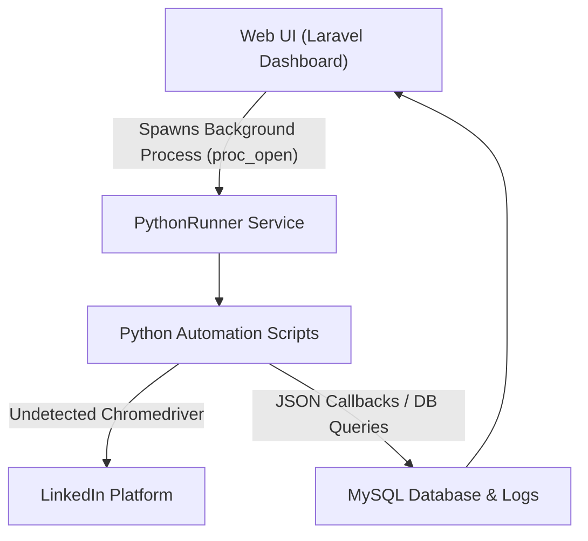
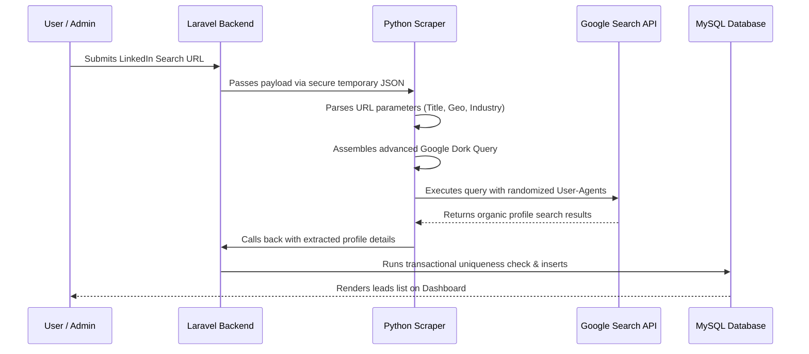
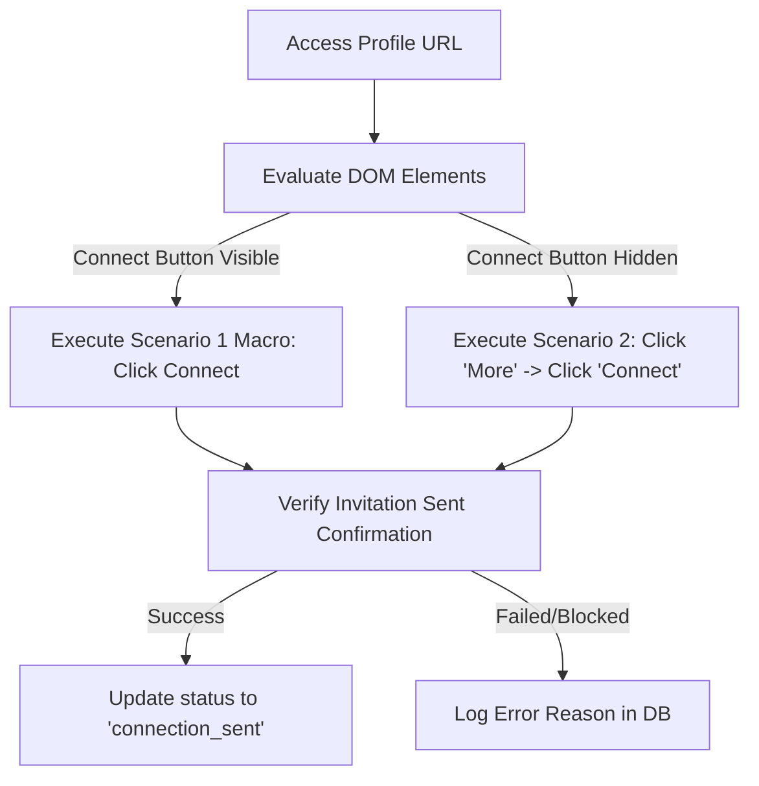
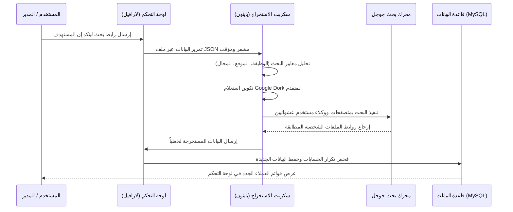
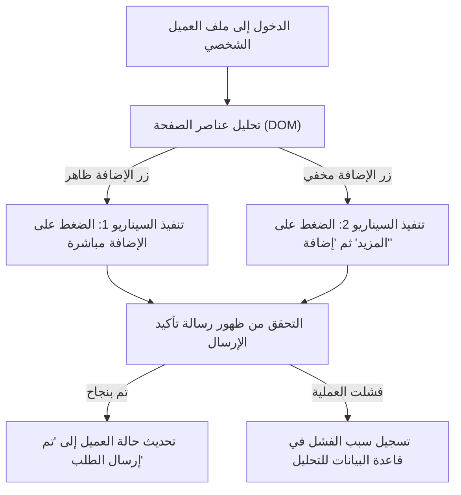

https://github.com/user-attachments/assets/a995bc7f-57bc-42c0-8ffe-54258c5440b3

# 🚀 LinkedIn Pro: Advanced Automation & Outreach Suite
### نظام أتمتة وإدارة عملاء لينكد إن المتقدم

A professional lead generation and automated outreach system that integrates a **Laravel 12** control panel with autonomous **Python Selenium** agents and **Google Gemini AI**.

نظام متميز لإدارة العملاء والتواصل التلقائي على منصة لينكد إن، يدمج بين لوحة تحكم بـ **Laravel 12** ومحركات أتمتة مستقلة بلغة **Python (Selenium)** مع دمج الذكاء الاصطناعي **Google Gemini AI**.

---

> [!NOTE]  
> **Repository Scope | نطاق المستودع:**  
> This public repository serves as a portfolio showcase and contains only documentation and architectural designs. The proprietary source code is hosted in a private repository for security and intellectual property protection.  
> هذا المستودع العام مخصص للعرض والمحفظة البرمجية فقط ويحتوي على الشرح الفني والهندسي للمشروع. الكود البرمجي الفعلي محفوظ بالكامل في مستودع خاص لحماية الملكية الفكرية والأمان.

---

## 🏗️ Architectural Overview & Data Flow / بنية النظام وتدفق البيانات

---

## 🇺🇸 English Version

### 🌟 Core Workflows & Features

#### 1. Lead Extraction Flow (Google Dorking Engine)
Bypasses LinkedIn's commercial search limits by converting search filters into targeted Google Dork queries routed through geographic subdomains.

#### 2. Connection Builder (Macro Replay Engine)
Automates invitations using DPI-calibrated mouse clicks. The agent automatically detects profile button layouts and triggers the correct connection flow (direct connect vs dropdown connect).

#### 3. AI-Personalized Messaging & Response Tracking
* **Gemini AI Integration**: Generates contextual invitation and follow-up messages based on target's profile data.
* **Keystroke Simulation**: Types out messages with randomized delays (50-150ms) to bypass automation checks.
* **Inbox Monitoring**: Periodic background scans automatically mark leads as `Replied` when they respond.

### 🛠️ Technology Stack
* **Control Panel**: Laravel 12, Alpine.js, Tailwind CSS / Custom CSS.
* **Automation Core**: Python 3.13, Selenium, `undetected-chromedriver`.
* **AI Orchestration**: Google Gemini 2.5 Flash / Pro API.
* **Database**: MySQL.

---

## 🇪🇬 النسخة العربية (Arabic Version)

### 🌟 مسارات العمل والمميزات الرئيسية

#### 1. تدفق استخراج العملاء المستهدفين (محرك Google Dorking)
يتخطى قيود البحث التجاري للينكد إن عبر تحويل فلاتر البحث إلى استعلامات بحث متقدمة في جوجل وتوجيهها إقليمياً.

#### 2. منشئ الاتصالات التلقائي (محرك محاكاة السيناريوهات)
يؤتمت إرسال الطلبات بالاعتماد على إحداثيات شاشة دقيقة. يتعرف البوت تلقائياً على واجهة زر الإضافة ويحدد سيناريو الضغط المناسب (إضافة مباشرة أم عبر قائمة المزيد).

#### 3. مراسلة معززة بالذكاء الاصطناعي وتتبع الردود
* **دمج مع Gemini AI**: صياغة رسائل مخصصة للعملاء بناءً على مسمياتهم الوظيفية الحالية.
* **محاكاة الكتابة**: كتابة الرسائل حرفاً بحرف بتأخير عشوائي مابين (50 إلى 150 مللي ثانية) لتفادي الكشف.
* **مراقبة صندوق الوارد**: فحص دوري يقوم بتحديث حالة العميل إلى "تم الرد" تلقائياً في لوحة التحكم عند استلام رده.

### 🛠️ التقنيات البرمجية المستخدمة
* **لوحة التحكم والخلفية البرمجية**: Laravel 12، مع واجهات CSS وتأثيرات بصرية متقدمة.
* **محرك الأتمتة**: لغة Python 3، ومكتبة Selenium، ومتصفح `undetected-chromedriver`.
* **الذكاء الاصطناعي**: واجهة برمجة تطبيقات Google Gemini 2.5.
* **قاعدة البيانات**: MySQL.

---

## ⚠️ Disclaimer | إخلاء المسؤولية
This tool is built for educational and research purposes. Automating LinkedIn interactions may violate LinkedIn's Terms of Service. Use responsibly and at your own risk.  
تم تطوير هذه الأداة لأغراض تعليمية وبحثية فقط. قد تؤدي أتمتة العمليات على لينكد إن إلى انتهاك شروط الخدمة الخاصة بالمنصة. استخدمها على مسؤوليتك الخاصة.
